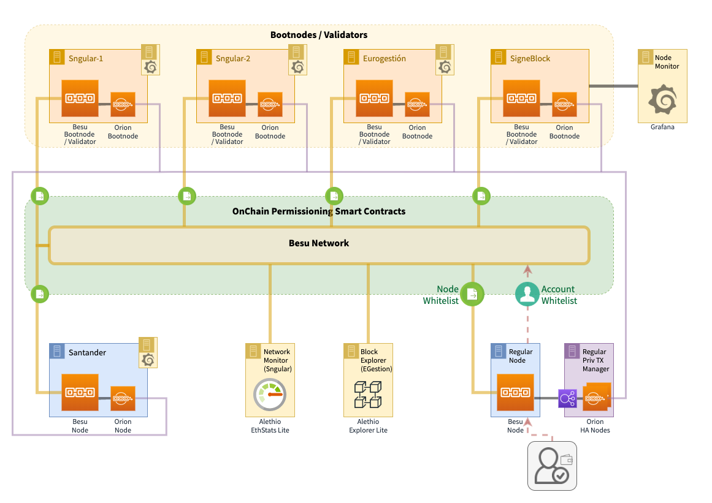

# ALASTRIA Red B #

* Visit [What is alastria](https://alastria.io/en/) page to know more about us.

This page contains technical information needed to work in the new Alastria Besu Network (Red B)

## System requirements

**Operating System**: Ubuntu 16.04 / 18.04 LTS 64 bits

**Hardware**:

| Hardware | minimum | desired |
|:------- |:-------- |:---------|
| **CPU's**: | 2 |  4 |
| **Memory**: | 4 Gb |  8 Gb |
| **Hard Disk**: | 100 Gb |  1000 Gb |

#### TCP/UDP PORTS

You'll need to open the following ports in both ways to deploy a node:

##### Validator Node 

| Port | Type | Definition |
|:------:|:-----:|:---------- |
|30303| TCP | Ethereum client listener and discovery ports |
|30303| UDP | Ethereum client listener and discovery ports |
|8080| TCP | Orion port (private transactions)|
|8546| TCP | RPC WS Port (internal only - for Ethstats client) |
|9090| TCP | Prometheus metrics |

##### Regular Node 

| Port | Type | Definition |
|:------:|:-----:|:---------- |
|30303| TCP | Ethereum client listener and discovery ports |
|30303| UDP | Ethereum client listener and discovery ports |
|8080| TCP | Orion port (private transactions)|
|8545| TCP | RPC HTPP Port (this can be internal only) |
|8546| TCP | RPC WS Port (this can be internal only) |
|9090| TCP | Prometheus metrics |

## Ignition Process

* [Description of the Ignition Process (creation of initial Besu & Orion Bootnodes)](docs/ignition-bootnodes.md)

## Installation & configuration of 

### [Regular node] Besu node + Orion

* [Regular node Installation Guide](docs/regular-node-installation-guide.md)

### [Validator node] Besu node

* [Validator node Installation Guide](docs/validator-node-installation-guide.md)

### [Regular node] Besu node + Orion + Prometheus + Ethstats-cli with Docker Compose

* [Regular node Compose Guide](docs/regular-node-compose.md)

### [Validator node] Besu node + Orion + Prometheus + Ethstats-cli with Docker Compose

* [Validator node Compose Guide](docs/validator-node-compose.md)

### Node monitoring

* [Prometheus and Grafana Monitoring](docs/prometheus-grafana.md)

### Ethstats Server

* [Installation Guide](docs/ethstats-installation.md)

# Red B Monitor

* [Red B Network Monitor (for Validators) - Hosted by Sngular](http://52.48.45.179)
* [Red B Block Explorer - Hosted by Eurogestión](http://5.153.57.78)

# Red B Initial Schema (2020-01)

